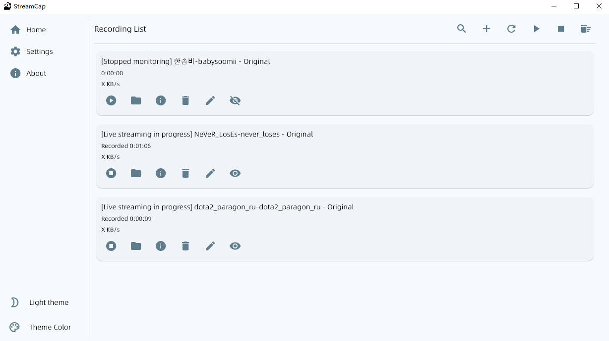

<div align="center">
  
</div>
<p align="center">
  
  <a href="https://github.com/ihmily/StreamCap">
      </a>
    <a href="https://hub.docker.com/r/ihmily/streamcap/tags">
      </a>
  <a href="https://github.com/ihmily/StreamCap/releases/latest">
      </a>
  <a href="https://github.com/ihmily/StreamCap/releases/latest">
      </a>
</p>
<div align="center">
  English / <a href="./README.md">Chinese</a>
</div><br>


StreamCap is a multi-platform live stream recording client based on FFmpeg and StreamGet. It covers over 40 mainstream live streaming platforms both domestically and internationally, and supports features such as batch recording, loop monitoring, timed monitoring, and automatic transcoding.

## ✨Features

- **Multi-Platform Support**: Compatible with Windows, macOS, and Web environments.
- **Loop Monitoring**: Real-time monitoring of live stream status. Recording starts immediately when a stream goes live.
- **Scheduled Tasks**: Checks live stream status within a set time range.
- **Multiple Output Formats**: Supports ts, flv, mkv, mov, mp4, mp3, m4a, and other formats.
- **Automatic Transcoding**: Automatically transcodes recorded files to mp4 format after recording.
- **Message Push**: Supports live stream status push notifications to keep you informed of live status.

## 📸Recording Interface



## 🛠️Quick Start

### 1. **Run the Pre-Built Program**

Visit the [StreamCap Releases](https://github.com/ihmily/StreamCap/releases/latest) page and download the latest version according to your operating system:

- **Windows Users**: Download the `StreamCap.zip` file, extract it, and run `StreamCap.exe`.
- **macOS Users**: Download the `StreamCap.dmg` file and follow the on-screen instructions to install, then you can find the application in the Launchpad to run it.

### 2. Running from Source Code

Ensure you have **Python 3.10** or a higher version installed.💥

1.**Clone the Project Code**:

```bash
git clone https://github.com/ihmily/StreamCap.git
cd StreamCap
```

2.**Install Dependencies**:

```bash
# Install core dependencies
pip install -i https://pypi.org/simple streamget 

# For desktop
pip install -r requirements.txt

# For web
pip install -r requirements-web.txt
```

3.**Configure the Runtime Environment**：

Copy the `.env.example` sample configuration file and rename it to `.env`

```bash
cp .env.example .env
```

4.**Run the Program**:

On Windows and macOS, the program runs as a desktop application by default. Use the following command to start the program:

```bash
python main.py
```

On Linux, please run in web mode. Modify the `.env` file and change the value of `PLATFORM` to `web` to run in web mode.

Alternatively, you can start it without modifying the configuration file by using the following command:

```bash
python main.py --web
```

After successful startup, access it via `http://127.0.0.1:6006`.For more configuration details, refer to the [Web Operation Guide](https://github.com/ihmily/StreamCap/wiki/Installation-Guide#web-operation)

If the program prompts that FFmpeg is missing, please visit the FFmpeg official download page [Download FFmpeg](https://ffmpeg.org/download.html) to download the precompiled FFmpeg executable files and configure the environment variables.

## 🐋Docker Running

No Python environment is required on your local machine. Before running the commands, ensure that you have installed [Docker](https://docs.docker.com/get-docker/) and [Docker Compose](https://docs.docker.com/compose/install/).

1.**Quick Start**

The simplest method is to use `docker compose`. Navigate to the project root directory and execute the following command (ensure the `.env` file exists):

```bash
docker compose up
```

You can use the `-d` flag to run in the background. Note that the default timezone in the container is `Asia/Shanghai`. If you need to change it, you can configure it in the `.env` file.

2.**Stop Container Instances**:

```bash
docker compose stop
```

3.**Build the Image(Optional)**:

The code version in the Docker image repository may not always be the latest. If you need to run the latest code from the main branch of this repository, you can build it locally as a custom image.

```
docker build -t streamcap .
```

## 😺 Supported Platforms

**Domestic Platforms (30+)**:  
Douyin, Kuaishou, Huya, Douyu, Bilibili, RedNote, YY, Inke, Acfun, Blued, JD, Taobao, ...

**International Platforms (10+)**:  
TikTok, Twitch, PandTV, Soop, Twitcasting, CHZZK, Shopee, YouTube, LiveMe, Flextv, Popkontv, Bigo, ...

**Example URLs**:  

If no specific note is provided, the live stream room URL is used for recording by default.

```
Douyin:
https://live.douyin.com/745964462470
https://v.douyin.com/iQFeBnt/ (Node.js Required)
https://live.douyin.com/yall1102  （Link+unique ID）
https://v.douyin.com/CeiU5cbX  (Anchor's homepage URL)

TikTok:
https://www.tiktok.com/@pearlgaga88/live

Kuaishou:
https://live.kuaishou.com/u/yall1102

Huya:
https://www.huya.com/52333

Douyu:
https://www.douyu.com/3637778?dyshid=
https://www.douyu.com/topic/wzDBLS6?rid=4921614&dyshid=

YY:
https://www.yy.com/22490906/22490906

BiliBili:
https://live.bilibili.com/320

ReadNote:
(One-time use URLs, not supported for loop monitoring)
http://xhslink.com/xpJpfM

Bigo:
https://www.bigo.tv/cn/716418802

Blued:
https://app.blued.cn/live?id=Mp6G2R

SOOP:
https://play.sooplive.co.kr/sw7love

Netease CC:
https://cc.163.com/583946984

Qiandurebo:
https://qiandurebo.com/web/video.php?roomnumber=33333

PandaTV:
https://www.pandalive.co.kr/live/play/bara0109

MaoerFM:
https://fm.missevan.com/live/868895007

Look Live:
https://look.163.com/live?id=65108820&position=3

WinkTV:
https://www.winktv.co.kr/live/play/anjer1004

FlexTV:
https://www.flextv.co.kr/channels/593127/live

PopkonTV:
https://www.popkontv.com/live/view?castId=wjfal007&partnerCode=P-00117
https://www.popkontv.com/channel/notices?mcid=wjfal007&mcPartnerCode=P-00117

TwitCasting:
https://twitcasting.tv/c:uonq

Baidu Live:
https://live.baidu.com/m/media/pclive/pchome/live.html?room_id=9175031377&tab_category

Weibo Live:
https://weibo.com/l/wblive/p/show/1022:2321325026370190442592

Kugou Live:
https://fanxing2.kugou.com/50428671?refer=2177&sourceFrom=

TwitchTV:
https://www.twitch.tv/gamerbee

LiveMe:
https://www.liveme.com/zh/v/17141543493018047815/index.html

Huajiao Live:
(One-time use URLs, not supported for loop monitoring)
https://www.huajiao.com/l/345096174

ShowRoom:
https://www.showroom-live.com/room/profile?room_id=480206  (Anchor's homepage URL)

Acfun:
https://live.acfun.cn/live/179922

Inke:
https://www.inke.cn/liveroom/index.html?uid=22954469&id=1720860391070904

Yinbo:
https://live.ybw1666.com/800002949

Zhihu:
https://www.zhihu.com/people/ac3a467005c5d20381a82230101308e9  (Anchor's homepage URL)

CHZZK:
https://chzzk.naver.com/live/458f6ec20b034f49e0fc6d03921646d2

Haixiu Live:
https://www.haixiutv.com/6095106

VVXqiu:
https://h5webcdn-pro.vvxqiu.com//activity/videoShare/videoShare.html?h5Server=https://h5p.vvxqiu.com&roomId=LP115924473&platformId=vvstar

17Live:
https://17.live/en/live/6302408

Lang Live:
https://www.lang.live/en-US/room/3349463

PiaoPiao Live:
https://m.pp.weimipopo.com/live/preview.html?uid=91648673&anchorUid=91625862&app=plpl

Six Room Live:
https://v.6.cn/634435

Lehai Live:
https://www.lehaitv.com/8059096

Catshow Live:
https://h.catshow168.com/live/preview.html?uid=19066357&anchorUid=18895331

Shopee:
https://sg.shp.ee/GmpXeuf?uid=1006401066&session=802458

Youtube:
(Requires configuring cookies)
https://www.youtube.com/watch?v=cS6zS5hi1w0

Taobao:
(Requires configuring cookies)
https://m.tb.cn/h.TWp0HTd

JD:
https://3.cn/28MLBy-E

Faceit:
https://www.faceit.com/zh/players/Compl1/stream
```

## 📖Documentation

For full documentation and advanced usage, visit the [official documentation](https://github.com/ihmily/StreamCap/wiki).

## ❤️Contributors

<a href="https://github.com/ihmily/StreamCap/graphs/contributors">
  
</a>

## 📜License

StreamCap is released under the Apache License 2.0. For more details, see the [LICENSE](./LICENSE) file.

## 🙏Special Thanks

Special thanks to the following open-source projects and technologies for their support:

- [flet](https://github.com/flet-dev/flet)
- [FFmpeg](https://ffmpeg.org)
- [streamget](https://github.com/ihmily/streamget)

If you have any questions or suggestions, please feel free to contact us via GitHub Issues.
