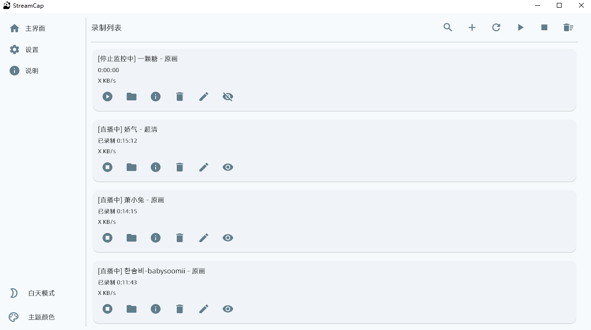

<div align="center">
  
</div>
<p align="center">
  
  <a href="https://github.com/ihmily/StreamCap">
      </a>
    <a href="https://hub.docker.com/r/ihmily/streamcap/tags">
      </a>
  <a href="https://github.com/ihmily/StreamCap/releases/latest">
      </a>
  <a href="https://github.com/ihmily/StreamCap/releases/latest">
      </a>
</p>
<div align="center">
  简体中文 / <a href="./README_EN.md">English</a>
</div><br>


StreamCap 是一个基于FFmpeg和StreamGet的多平台直播流录制客户端，覆盖 40+ 国内外主流直播平台，支持批量录制、循环监控、定时监控和自动转码等功能。

## ✨功能特性

- **多端支持**：支持Windows/MacOS/Web运行
- **循环监控**：实时监控直播间状态，开播即录。
- **定时任务**：根据设定时间范围检查直播间状态。
- **多种输出格式**：支持 ts、flv、mkv、mov、mp4、mp3、m4a 等格式。
- **自动转码**：录制完成后自动转码为 mp4 格式。
- **消息推送**：支持直播状态推送，及时获取开播通知。

## 📸录制界面



## 🛠️快速开始

### 1.**运行预构建的程序**：

访问 [StreamCap Releases](https://github.com/ihmily/StreamCap/releases/latest) 页面，根据自身系统下载对应的最新版本压缩包。

- **Windows 用户**：下载 `StreamCap.zip` 文件，解压后运行 `StreamCap.exe`。
- **macOS 用户**：下载 `StreamCap.dmg` 文件，按照提示完成安装，即可在启动台找到应用并运行。

### 2.从源代码运行

确保已安装 **Python 3.10** 或更高版本。💥

1.**克隆项目代码**：

```bash
git clone https://github.com/ihmily/StreamCap.git
cd StreamCap
```

2.**安装依赖**：

```bash
# 安装核心依赖
pip install -i https://pypi.org/simple streamget 

# 桌面端
pip install -r requirements.txt

# Web端
pip install -r requirements-web.txt
```

3.**配置运行环境**：

将.env.example示例配置文件复制一份并将文件重命名为.env

```bash
cp .env.example .env
```

4.**运行程序**：

在Windows和macOS上默认以桌面程序的方式运行，使用以下命令启动程序：

```bash
python main.py
```

Linux请使用web方式运行，修改 `.env` 文件，将 `PLATFORM` 的值改为 `web`，即可以Web方式运行。

或者无需修改配置文件，直接使用以下命令启动

```bash
python main.py --web
```

启动成功后，通过 `http://127.0.0.1:6006` 访问。更多配置请参考 [Web运行指南](https://github.com/ihmily/StreamCap/wiki/安装指南#web-端运行)

如果程序提示缺少 FFmpeg，请访问 FFmpeg 官方下载页面[Download FFmpeg](https://ffmpeg.org/download.html)，下载预编译的 FFmpeg 可执行文件，并配置环境变量。

## 🐋容器运行

本机无需Python环境运行，在运行命令之前，请确保您的机器上安装了 [Docker](https://docs.docker.com/get-docker/) 和 [Docker Compose](https://docs.docker.com/compose/install/) 

1.**快速启动**

最简单方法是使用`docker compose`运行，进入项目根目录后，只需简单执行以下命令(确保已经存在`.env`文件)：

```bash
docker compose up
```

可选 `-d` 在后台运行。注意容器内时区问题，默认使用的是 `Asia/Shanghai` ，如需修改可以在.env文件配置。

2.**停止容器实例**

```bash
docker compose stop
```

3.**构建镜像(可选)**

Docker仓库中的镜像的代码版本不一定是最新的，如有需要运行本仓库主分支最新代码，可以本地自定义构建

```bash
docker build -t streamcap .
```

## 😺已支持平台

**国内平台（30+）**：

抖音、快手、虎牙、斗鱼、B站、小红书、YY、映客、Acfun、Blued、京东、淘宝...

**海外平台（10+）**：

TikTok、Twitch、PandTV、Soop、Twitcasting、CHZZK、Shopee、Youtube、LiveMe、Flextv、Popkontv、Bigo...

**示例地址：**

如未特殊备注，默认使用直播间地址录制

```
抖音:
https://live.douyin.com/745964462470
https://v.douyin.com/iQFeBnt/  (需Node.js)
https://live.douyin.com/yall1102  （链接+抖音号）
https://v.douyin.com/CeiU5cbX  （主播主页地址）

TikTok:
https://www.tiktok.com/@pearlgaga88/live

快手:
https://live.kuaishou.com/u/yall1102

虎牙:
https://www.huya.com/52333

斗鱼:
https://www.douyu.com/3637778?dyshid=
https://www.douyu.com/topic/wzDBLS6?rid=4921614&dyshid=

YY:
https://www.yy.com/22490906/22490906

B站:
https://live.bilibili.com/320

小红书:
http://xhslink.com/xpJpfM  (一次性地址，暂不支持循环监控)

bigo直播:
https://www.bigo.tv/cn/716418802

buled直播:
https://app.blued.cn/live?id=Mp6G2R

SOOP:
https://play.sooplive.co.kr/sw7love

网易cc:
https://cc.163.com/583946984

千度热播:
https://qiandurebo.com/web/video.php?roomnumber=33333

PandaTV:
https://www.pandalive.co.kr/live/play/bara0109

猫耳FM:
https://fm.missevan.com/live/868895007

Look直播:
https://look.163.com/live?id=65108820&position=3

WinkTV:
https://www.winktv.co.kr/live/play/anjer1004

FlexTV:
https://www.flextv.co.kr/channels/593127/live

PopkonTV:
https://www.popkontv.com/live/view?castId=wjfal007&partnerCode=P-00117
https://www.popkontv.com/channel/notices?mcid=wjfal007&mcPartnerCode=P-00117

TwitCasting:
https://twitcasting.tv/c:uonq

百度直播:
https://live.baidu.com/m/media/pclive/pchome/live.html?room_id=9175031377&tab_category

微博直播:
https://weibo.com/l/wblive/p/show/1022:2321325026370190442592

酷狗直播:
https://fanxing2.kugou.com/50428671?refer=2177&sourceFrom=

TwitchTV:
https://www.twitch.tv/gamerbee

LiveMe:
https://www.liveme.com/zh/v/17141543493018047815/index.html

花椒直播:
https://www.huajiao.com/l/345096174  (一次性地址，暂不支持循环监控)

ShowRoom:
https://www.showroom-live.com/room/profile?room_id=480206  (主播主页地址)

Acfun:
https://live.acfun.cn/live/179922

映客直播:
https://www.inke.cn/liveroom/index.html?uid=22954469&id=1720860391070904

音播直播:
https://live.ybw1666.com/800002949

知乎直播:
https://www.zhihu.com/people/ac3a467005c5d20381a82230101308e9  (主播主页地址)

CHZZK:
https://chzzk.naver.com/live/458f6ec20b034f49e0fc6d03921646d2

嗨秀直播:
https://www.haixiutv.com/6095106

VV星球直播:
https://h5webcdn-pro.vvxqiu.com//activity/videoShare/videoShare.html?h5Server=https://h5p.vvxqiu.com&roomId=LP115924473&platformId=vvstar

17Live:
https://17.live/en/live/6302408

浪Live:
https://www.lang.live/en-US/room/3349463

畅聊直播:
https://live.tlclw.com/106188

飘飘直播:
https://m.pp.weimipopo.com/live/preview.html?uid=91648673&anchorUid=91625862&app=plpl

六间房直播:
https://v.6.cn/634435

乐嗨直播:
https://www.lehaitv.com/8059096

花猫直播:
https://h.catshow168.com/live/preview.html?uid=19066357&anchorUid=18895331

Shopee:
https://sg.shp.ee/GmpXeuf?uid=1006401066&session=802458

Youtube(需配置cookie):
https://www.youtube.com/watch?v=cS6zS5hi1w0

淘宝(需配置cookie):
https://m.tb.cn/h.TWp0HTd

京东:
https://3.cn/28MLBy-E

Faceit:
https://www.faceit.com/zh/players/Compl1/stream
```

## 📖文档

如需完整文档和高级用法，请访问官方文档 [Wiki](https://github.com/ihmily/StreamCap/wiki/%E4%B8%BB%E9%A1%B5)

## ❤️贡献者

<a href="https://github.com/ihmily/StreamCap/graphs/contributors">
  
</a>

## 📜许可证

StreamCap在Apache License 2.0下发布。有关详情，请参阅[LICENSE](./LICENSE)文件。

## 🙏特别感谢

特别感谢以下开源项目和技术的支持：

- [flet](https://github.com/flet-dev/flet)
- [FFmpeg](https://ffmpeg.org)
- [streamget](https://github.com/ihmily/streamget)

如果您有任何问题或建议，请随时通过GitHub Issues与我们联系。
